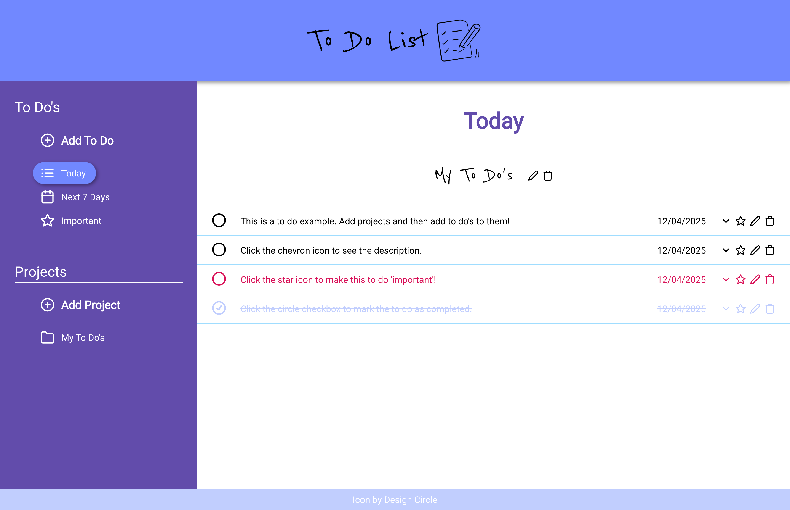

# To Do List

Create projects and add to do items to them. Stores data in local storage.



## Tech Stack

<!-- Badges from https://github.com/Ileriayo/markdown-badges -->


## Usage

(Port 8080)

```
  npm run dev
```

## Build for production

```
  npm run build
```

## Deploy/Redeploy to GitHub Pages

Make sure you have all your work committed/pushed on main branch `git status`

Make sure you have a gh-pages branch `git branch gh-pages`

```
  git checkout gh-pages && git merge main --no-edit

  npm run build

  git add dist -f && git commit -m "Deployment commit"

  npm run deploy

  git checkout main
```

Note: Recall that the source branch for GitHub Pages is set in your repository’s settings. Get this changed to the gh-pages branch.
